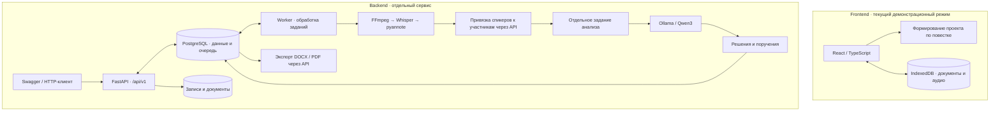

# Протокол · Nexora

### Совещание → протокол → поручения → контроль исполнения

Рабочее пространство для подготовки протоколов совещаний и контроля принятых решений. Секретарь проверяет содержание документа, ответственных и сроки; руководитель видит состояние поручений в едином интерфейсе.

Проект объединяет русскоязычный веб-интерфейс и отдельный backend для обработки аудио, разделения речи по спикерам и анализа транскрипта локальными моделями.

> **Текущий статус: MVP.** Frontend работает самостоятельно с IndexedDB и демонстрационным анализом повестки. Backend реализует отдельный API с Whisper, pyannote и Ollama. HTTP-интеграция интерфейса с backend ещё не выполнена: совместный запуск контейнеров не связывает их данные автоматически.

[Быстрый старт](#быстрый-старт) · [Возможности](#возможности) · [Архитектура](#архитектура) · [API](#api) · [Проверки](#проверки) · [План развития](#план-развития)

---

## Возможности

| Область | Веб-интерфейс | Backend API |
| :--- | :--- | :--- |
| Совещания | Название, дата, участники, подразделения и повестка | Загрузка аудио/видео, дата с часовым поясом, участники |
| Аудио | Запись с микрофона, таймер, прослушивание и скачивание | Проверка файла и преобразование FFmpeg в mono, 16 kHz |
| Расшифровка | Явно обозначенный демонстрационный текст | faster-whisper large-v3, временные метки, многоязычный режим |
| Спикеры | Имена участников в демосценарии | pyannote community-1 и ручная привязка голосов к участникам |
| Протокол | Редактирование вопросов, решений и поручений; утверждение | Summary, темы, решения и поручения через Ollama / Qwen3 |
| Контроль | Статусы, поиск, фильтры, просрочка и внутренние уведомления | Фильтры, приоритеты, редактирование, отмена поручений |
| Документы | Печать утверждённого протокола | Экспорт проекта протокола в DOCX и PDF |
| Хранение | IndexedDB в текущем браузере, включая аудио | PostgreSQL, файловое хранилище записей и результатов |

### Сценарий работы в интерфейсе

1. Создайте совещание: укажите дату, участников, подразделения и вопросы повестки.
2. При необходимости запишите аудио и прослушайте результат.
3. Запустите **демораспознавание** — проект будет сформирован по повестке. Аудио при этом не анализируется и не отправляется на сервер.
4. Проверьте вопросы, решения и каждое поручение: содержание, ответственного, срок, подразделение, инициатора и связанный вопрос повестки.
5. Утвердите протокол. Поручения появятся в реестре; повторное утверждение не создаёт дубликаты.
6. Контролируйте исполнение через разделы «Поручения» и «Уведомления».

Утверждённый протокол доступен для просмотра и печати. Его содержание фиксируется, а статусы исполнения изменяются отдельно в реестре поручений.

### Правила исполнения

- В интерфейсе доступны статусы **«Новое»**, **«В работе»**, **«Исполнено»**, **«Просрочено»**.
- Просрочка рассчитывается со следующего календарного дня после срока, по локальной дате браузера. Исполненные поручения не становятся просроченными.
- В уведомления попадают просроченные поручения и сроки на сегодня или ближайшие три дня.
- Восстановление демоданных сохраняет созданные пользователем совещания и их поручения.
- В API дополнительно предусмотрен статус `CANCELLED`; сроки обрабатываются с учётом часового пояса совещания. Согласование моделей данных frontend и backend входит в следующий этап интеграции.

## Архитектура



**Frontend:** React 19, TypeScript, Vinext / Vite, Tailwind CSS и компоненты на Radix UI. Главная страница показывает документы на проверке и поручения, требующие внимания; интерфейс адаптирован для мобильных экранов.

**Backend:** Python 3.12, FastAPI, Pydantic 2, SQLAlchemy async, PostgreSQL 17 и Alembic. Тяжёлая обработка выполняется отдельным worker. Очередь хранится в PostgreSQL; предусмотрены heartbeat, восстановление зависших заданий и защита от одновременного выполнения одной встречи.

**Модели:** faster-whisper large-v3 для транскрипции, pyannote community-1 для определения спикеров, Qwen3:8b через Ollama для анализа текста. Для решений и поручений проверяются ссылки на сегменты и цитаты-основания. Результат остаётся проектом документа и требует проверки человеком.

### Структура репозитория

```text
app/                    Интерфейс, запись аудио, редактор протокола
components/ui/          Библиотека UI-компонентов
lib/                    Типы, бизнес-правила, IndexedDB и демосервис
tests/                  Тесты бизнес-логики frontend
scripts/                Запуск, сборка и проверки frontend
backend/
  app/api/              HTTP API
  app/models/           ORM-модели и статусы
  app/schemas/          Контракты запросов и ответов
  app/repositories/     Работа с данными
  app/services/         Обработка аудио, AI-анализ и экспорт
  app/worker.py         Обработчик очереди
  alembic/              Миграции PostgreSQL
  tests/                API, pipeline, безопасность загрузки и экспорт
  scripts/              Подготовка моделей и диагностические проверки
docker-compose.yml      Совместный запуск frontend и backend
Dockerfile              Образ frontend
```

## Быстрый старт

### 1. Интерфейс без моделей и backend

Требуется **Node.js 22.13 или новее**.

```sh
git clone https://github.com/BAITC-Hacks/hack-d13e095c-nexora.git
cd hack-d13e095c-nexora
npm ci
npm run dev
```

Откройте адрес из вывода сервера; стандартный адрес — [localhost:5173](http://localhost:5173).

Запись с микрофона требует разрешения браузера и защищённого контекста: HTTPS или localhost. Для демонстрационного формирования протокола запись не обязательна.

### 2. Frontend и backend через Docker

Требуется Docker с Compose v2, поддерживающим `include` и `depends_on.required`. Для моделей понадобится несколько гигабайт свободного места; по умолчанию используется CPU.

**Корневой Compose настроен на внешнюю Ollama** — на этом компьютере или другом устройстве в локальной сети. Модель `qwen3:8b` должна быть подготовлена на том сервере. Локальные сервисы Ollama в этой конфигурации по умолчанию отключены.

Подготовьте окружение из корня проекта:

```sh
cp backend/.env.example backend/.env
```

В PowerShell вместо `cp` можно использовать `Copy-Item backend/.env.example backend/.env`.

Перед запуском:

- Примите условия модели `pyannote/speaker-diarization-community-1` в Hugging Face и укажите read-токен в `HF_TOKEN`.
- Задайте `OLLAMA_URL`: например, `http://192.168.1.100:11434` для другого ПК. Адрес и порт должны быть доступны из контейнеров.
- При необходимости настройте порты, пароль PostgreSQL и общий ключ API.

```sh
docker compose --env-file backend/.env up --build -d
docker compose --env-file backend/.env ps -a
docker compose --env-file backend/.env logs -f bootstrap api worker frontend
```

| Сервис | Адрес по умолчанию |
| :--- | :--- |
| Веб-интерфейс | [http://localhost:5173](http://localhost:5173) |
| Swagger UI | [http://localhost:8000/docs](http://localhost:8000/docs) |
| OpenAPI | [http://localhost:8000/openapi.json](http://localhost:8000/openapi.json) |
| Готовность БД | [http://localhost:8000/api/v1/health/ready](http://localhost:8000/api/v1/health/ready) |
| Наличие моделей | [http://localhost:8000/api/v1/health/models](http://localhost:8000/api/v1/health/models) |

Первый запуск скачивает веса Whisper и pyannote. Доступность API не означает завершение подготовки моделей. Проверка `health/models` проверяет их наличие и доступность Ollama, но не заменяет пробную обработку записи.

Остановка с сохранением данных:

```sh
docker compose --env-file backend/.env down
```

Не добавляйте `-v`, если нужно сохранить named volumes с базой и записями. Веса Whisper и pyannote хранятся отдельно в `backend/models/`.

### 3. Backend с Ollama внутри Docker

Для отдельного backend со своей Ollama используется базовый Compose из каталога `backend`:

```sh
cd backend
docker compose up --build -d
```

В этом режиме initialization-сервис загружает Qwen, а рабочая Ollama запускается в Docker. Нативный запуск, GPU, offline-режим, настройка моделей и полный сценарий работы описаны в [документации backend](backend/README.md).

## Конфигурация

Основные параметры `backend/.env`:

| Переменная | Назначение |
| :--- | :--- |
| `HF_TOKEN` | Доступ к первоначальной загрузке gated-модели pyannote |
| `OLLAMA_URL` | Адрес внешней Ollama для корневого Compose |
| `OLLAMA_MODEL` | Модель анализа; по умолчанию `qwen3:8b` |
| `AI_DEVICE` | `cpu` или `cuda`; GPU требует отдельной конфигурации |
| `WHISPER_COMPUTE_TYPE` | Режим вычислений Whisper; по умолчанию `int8` |
| `POSTGRES_PASSWORD` | Пароль базы данных |
| `API_PORT` / `FRONTEND_PORT` | Порты API и интерфейса: `8000` / `5173` |
| `API_KEY` | Необязательный общий ключ; передаётся в заголовке `X-API-Key` |

Лимиты backend по умолчанию: **512 МБ на файл** и **4 часа аудио**. Они настраиваются через `MAX_UPLOAD_MB` и `MAX_AUDIO_SECONDS`. Полный набор параметров — в [Settings](backend/app/config.py) и Compose-файлах.

## API

Рабочий процесс backend состоит из двух отдельных заданий:

```text
Загрузка → QUEUED → PROCESSING → AWAITING_MAPPING
                                      ↓
                         привязка спикеров к участникам
                                      ↓
                         analyze → ANALYZING → COMPLETED
```

При ошибке сохраняются статус `FAILED` и диагностический код. Анализ можно повторить без повторного распознавания; ручные правки поручений сохраняются.

| Метод и путь | Назначение |
| :--- | :--- |
| `POST /api/v1/meetings` | Загрузка файла; ответ `202` с идентификатором встречи |
| `GET /api/v1/meetings/{id}` | Статус, текущий этап и результаты анализа |
| `GET /api/v1/meetings/{id}/transcript` | Транскрипт с временными метками и спикерами |
| `POST /api/v1/meetings/{id}/participants` | Добавление участника |
| `PATCH /api/v1/meetings/{id}/speakers/{speaker_id}` | Привязка спикера к участнику |
| `POST /api/v1/meetings/{id}/analyze` | Запуск анализа после проверки привязок |
| `GET /api/v1/tasks` | Поручения с фильтрами по встрече, ответственному, сроку и статусу |
| `PATCH /api/v1/tasks/{id}` | Изменение поручения |
| `GET /api/v1/meetings/{id}/exports/docx` | Экспорт проекта протокола в DOCX |
| `GET /api/v1/meetings/{id}/exports/pdf` | Экспорт проекта протокола в PDF |

Примеры запросов, обязательные поля, повторная обработка и контракты ошибок приведены в [руководстве API](backend/README.md#рабочий-сценарий-api). При заданном `API_KEY` запросы к `/api/v1`, включая health endpoints, требуют `X-API-Key`.

## Хранение и приватность

- **Frontend:** документы и аудио находятся в IndexedDB конкретного браузера и адреса сайта. Перезагрузка сохраняет данные; очистка хранилища сайта удаляет их. Автоматической синхронизации между устройствами нет.
- **Backend:** PostgreSQL хранит встречи, участников, спикеров, транскрипты, поручения и задания. Исходные записи и документы находятся в отдельном файловом хранилище.
- **AI:** облачные inference API не используются. При внешней Ollama текст передаётся на указанный сервер в локальной сети.
- **Сеть:** базовый backend Compose изолирует рабочие сервисы во внутренней Docker-сети. Конфигурация с внешней Ollama добавляет API и worker сеть доступа к её серверу.
- **Доступ:** API и frontend в Compose опубликованы на loopback-интерфейсе. Общий API-ключ предусмотрен; пользователей, RBAC, SSO и разделения организаций пока нет.

Не сохраняйте реальные токены в репозитории. После успешной подготовки моделей HF-токен можно убрать из локального `.env`; для обработки уже загруженными моделями он не требуется.

## Проверки

### Frontend

Выполняются из корня репозитория:

```sh
npx tsc --noEmit
node scripts/test-domain.mjs
npm run build
```

Семь тестов покрывают утверждение без дубликатов, обязательные поля, протокол без поручений, расчёт просрочки, уведомления, границы календаря и восстановление демоданных.

### Backend

В отдельном Python 3.12-окружении, из каталога `backend`:

```sh
python -m pip install -r requirements-dev.txt
python -m pytest -q
python -m ruff check app tests scripts alembic
python -m ruff format --check app tests scripts alembic
```

Для проверки PostgreSQL задайте `TEST_DATABASE_URL` на отдельную тестовую БД. Без этой переменной используется SQLite и пропускается тест PostgreSQL-конкурентности.

### Подтверждённый статус

| Проверка | Результат и границы |
| :--- | :--- |
| Frontend: TypeScript и сборка | Пройдены для синхронизированной версии интерфейса |
| Frontend: бизнес-логика | **7 тестов пройдены** |
| Backend | В [отчёте от 23.09.2026](backend/VERIFICATION.md) зафиксированы **78 passed**, проверки миграций, HTTP API, FFmpeg и экспорта |
| Docker Compose | Конфигурация добавлена; фактический контейнерный запуск в отчёте не подтверждён |
| Реальные AI-модели и GPU | Сквозная обработка пользовательской записи и качество распознавания пока не проверены |

Backend pipeline-тесты используют подставные ответы моделей. Они проверяют логику обработки, но не качество распознавания русской и казахской речи, определения спикеров или извлечения поручений.

Подробнее: [проверки исходного frontend-прототипа](VERIFICATION.md) и [проверки backend](backend/VERIFICATION.md). Запись с физического микрофона и системный диалог печати требуют отдельной проверки на целевом устройстве.

## План развития

1. Подключить frontend к API: загрузка записи, получение статусов, работа со спикерами и сохранение результатов.
2. Согласовать модели данных и перенести утверждение протокола на сервер, сохранив обязательную проверку человеком.
3. Провести сквозную приёмку на реальных записях: русский и казахский языки, качество транскрипции, спикеры, решения и сроки.
4. Подключить внешнюю СЭД, ролевой доступ и доставку уведомлений исполнителям.

Сейчас уведомления интерфейса работают внутри приложения. Автоматическая отправка поручений во внешнюю СЭД, email/push-уведомления и потоковое распознавание в состав MVP не входят.

---

Разработано командой **Nexora**.  
[Репозиторий](https://github.com/BAITC-Hacks/hack-d13e095c-nexora) · [Backend](backend/README.md) · [Отчёт о проверках](backend/VERIFICATION.md)
